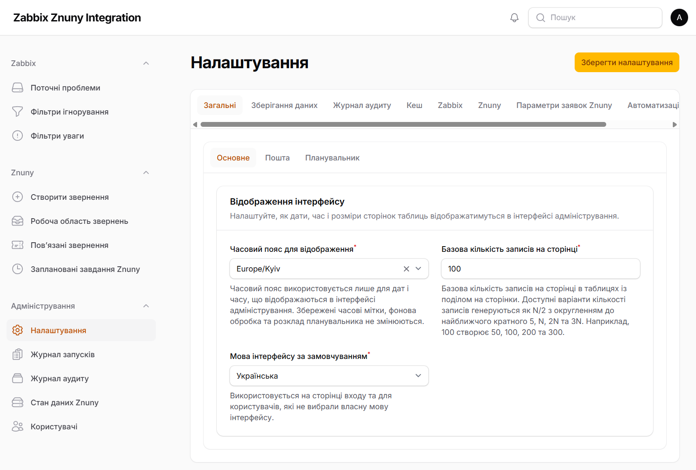
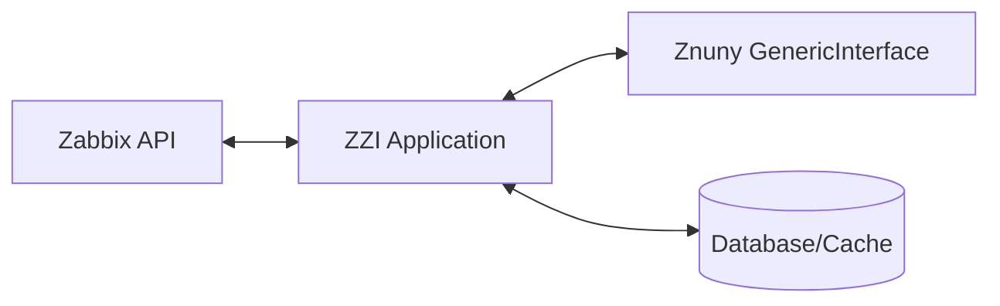

# Zabbix Znuny Integration

Zabbix Znuny Integration (ZZI) is a specialized Laravel/Filament application designed to bridge Zabbix monitoring workflows with Znuny (or OTRS) ticketing operations.

When an infrastructure issue is detected by Zabbix, NOC teams often need to translate that technical event into a tracked IT service management ticket in Znuny. ZZI solves this by providing a unified, web-based workspace. Instead of being a native Zabbix template or a direct Znuny core patch, ZZI acts as a dedicated middleware application.

It gives your operators a single pane of glass to view active Zabbix problems, intelligently group duplicate alerts, lookup Znuny agents/queues, and create fully populated Znuny tickets directly from the dashboard.



## Highlights / Features

### Zabbix Integration
- **Current Problems Dashboard**: View, filter, and acknowledge active Zabbix problems in real-time.
- **Problem Filtering & Ignore Workflows**: Set up ignore filters and attention workflows to reduce alert fatigue.
- **Bi-directional Linking**: Click directly back to Zabbix using native event and trigger IDs.

### Znuny Ticket Workspace
- **Ticket Creation**: Manually or automatically generate Znuny tickets with pre-filled event metadata.
- **Workspace Lookups**: Fast, cache-backed lookups for Znuny Customers, Users, Queues, and Agents.
- **Ticket Management**: View related tickets and interact with existing tickets via the dedicated workspace.
- **Inline Image Handling**: Built-in support for caching and pre-warming inline images so ticket articles load instantly.

### Automation & Operations
- **Scheduled Ticket Creation**: Automated, resilient background scheduling to attempt Znuny ticket creation with duplicate guards and manual retry capabilities.
- **Run & Audit Logs**: Detailed audit logging for all ticket creation attempts, successes, and API failures.
- **Administration UI**: A comprehensive Filament-based settings panel to configure API endpoints, storage options, cache TTLs, and automation rules.

## Architecture

At a high level, the integration looks like this:



- **Zabbix API**: Provides real-time problem data and event triggers.
- **ZZI Application**: The Laravel/Filament hub that polls Zabbix, normalizes the data, applies caching, and presents the NOC workspace UI.
- **Znuny GenericInterface**: The REST API surface where ZZI pushes new tickets, reads queues, and syncs ticket status.
- **Database / Cache**: Backs the Filament UI, stores audit logs, and caches Znuny metadata (queues, agents) to ensure fast rendering without hammering the Znuny API.

## Required Znuny Extension

**IMPORTANT:** To safely interact with Znuny, this application requires a companion extension to be installed on your Znuny server.

**ZnunyAgentList**
[https://github.com/Edrard/ZnunyAgentList](https://github.com/Edrard/ZnunyAgentList)

This extension exposes a controlled GenericInterface REST surface used by integration systems (like ZZI) for safe metadata lookups (queues, customers, agents) and controlled ticket operations.

- Install a compatible release from the ZnunyAgentList repository.
- Use a dedicated API agent/account for ZZI to connect to Znuny.
- Import the included Web Service template (`examples/webservices/AdvancedZnunyAgentListREST.yml`) into Znuny. **Importing the `.opm` package alone does not automatically install the Web Service configuration.**
- Configure SysConfig authorization/write settings as required. Write operations are protected separately and should only be enabled when needed.

This extension does not modify Znuny core; it securely exposes necessary data via the standard GenericInterface.

## Requirements

- **PHP**: 8.3+
- **Laravel**: 11.x (Framework 13.x)
- **Filament**: 4.x
- **Composer**: 2.x
- **Database**: SQLite, MySQL, or PostgreSQL
- **Redis**: Optional, but recommended for production caching, queues, and inline image warming.
- **Node.js/NPM**: Required only for building frontend assets via Vite.
- **Network**: HTTP/S access to both the Zabbix API and Znuny GenericInterface.

## Installation

1. **Clone the repository**:
   ```bash
   git clone https://github.com/Edrard/zzi.git
   cd zzi
   ```

2. **Install Composer dependencies**:
   ```bash
   composer install --optimize-autoloader --no-dev
   ```

3. **Configure Environment**:
   ```bash
   cp .env.example .env
   php artisan key:generate
   ```
   Update your `.env` file with appropriate database credentials and configuration.

4. **Database Setup**:
   ```bash
   php artisan migrate
   ```

5. **Frontend Assets** (if building from source):
   ```bash
   npm install --ignore-scripts
   npm run build
   ```

6. **Scheduler & Queue**:
   Ensure the Laravel scheduler is running. Add this to your system crontab:
   ```bash
   * * * * * cd /path/to/zzi && php artisan schedule:run >> /dev/null 2>&1
   ```
   If you are using a queue driver other than `sync` (e.g., database or Redis), start the queue worker:
   ```bash
   php artisan queue:work
   ```

7. **Configure the Application**:
   Log in to the web interface (default path: `/admin`) and configure your Zabbix and Znuny endpoints via the **Settings** menu.

## Znuny Setup Checklist

1. Install the [ZnunyAgentList](https://github.com/Edrard/ZnunyAgentList) package on your Znuny server.
2. Create a dedicated API agent user in Znuny.
3. Configure the allowed groups in SysConfig to grant the agent access.
4. If you plan to create tickets via ZZI, configure the write groups in SysConfig to explicitly enable write access.
5. Import `AdvancedZnunyAgentListREST.yml` into your Znuny Web Services configuration.
6. Verify the GenericInterface endpoint is reachable.
7. Enter the endpoint URL and agent credentials into the ZZI Settings UI.

## Zabbix Setup

ZZI connects to Zabbix via its native API. You will need:
- **Endpoint URL**: The base URL to your Zabbix API (e.g., `https://zabbix.example.invalid/api_jsonrpc.php`).
- **Authentication**: A Zabbix API token or a dedicated read-only service account (username and password) configured in Zabbix.
- **Problem URL Template**: (Optional) A URL template if you wish to link directly back to Zabbix problems from the ZZI dashboard (supports `{event_id}` and `{trigger_id}` placeholders if your configuration uses them).

## Application Configuration

Operational settings are fully managed from the Filament administration UI (`/admin/settings`). Major configuration areas include:

- **General**: UI display timezone, default language, and pagination options.
- **Data Storage**: Caching preferences, inline image storage configurations, and database cleanup policies.
- **Audit Log**: Retention periods for the ticket creation audit logs.
- **Zabbix**: API endpoints, authentication tokens, and problem URL templates.
- **Znuny**: GenericInterface endpoint, API credentials, and cache warming intervals.
- **Znuny Ticket Parameters**: Default priorities, states, article types, and dynamic field mappings for new tickets.
- **Automation**: Polling intervals and manual ticket auto-close behaviors.

## Scheduler & Background Jobs

ZZI relies heavily on background tasks to keep its caches warm and sync data without slowing down the UI. The application uses the standard Laravel scheduler to dispatch these jobs.

Once `php artisan schedule:run` is configured in your crontab, ZZI will automatically handle:
- Zabbix problem polling
- Znuny metadata pre-warming (queues, agents, lookups)
- Inline image cache syncing
- Database cleanup

## Testing

You can run the test suite safely using the provided isolated script, which ensures that local or staging database states are not accidentally modified:

```bash
bash scripts/phpunit-safe.sh
```

## Security

- **Environment Variables**: Keep all infrastructure credentials, database passwords, and API tokens in your `.env` file. Never commit `.env` to version control.
- **API Accounts**: Use dedicated, least-privilege service accounts for Zabbix and Znuny rather than personal administrator accounts.
- **Znuny Writes**: Keep Znuny write operations disabled in SysConfig unless you actively use ZZI to create or update tickets.
- **Protected Settings**: ZZI optionally encrypts sensitive settings (like API passwords and tokens) in its database if configured.

## Project Scope

ZZI is an integration workspace. It is **not**:
- A replacement for Zabbix or Znuny.
- A fork or modification of the Znuny core application.
- A native Zabbix server component or plugin.

## License

This project is open-sourced software licensed under the [MIT license](LICENSE).

Copyright (c) 2026 Oleksandr Ustinov

---
Created with the support of **Vamark** — [https://vamark.ua](https://vamark.ua).
